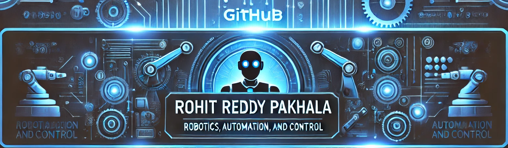
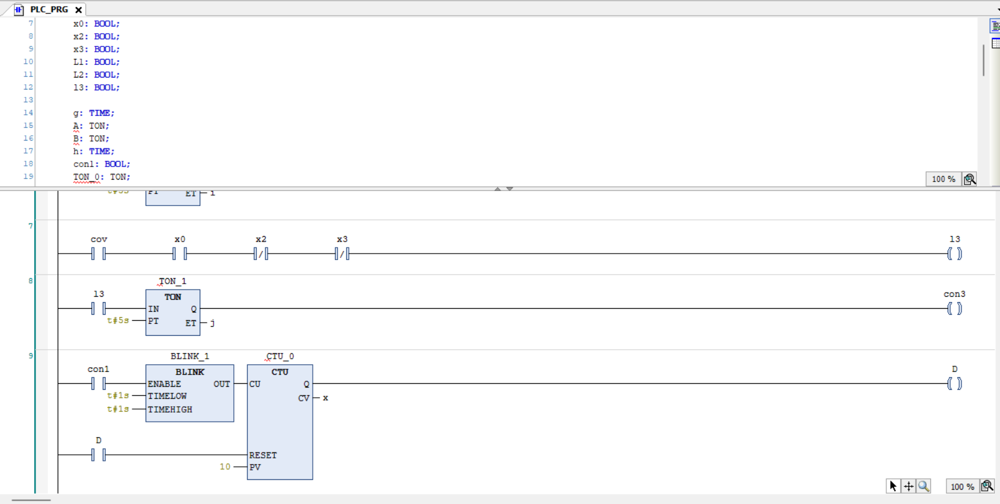
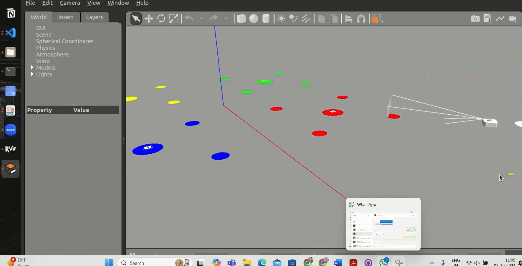
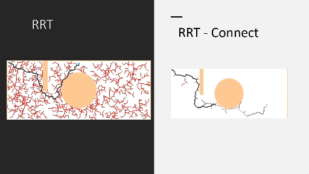
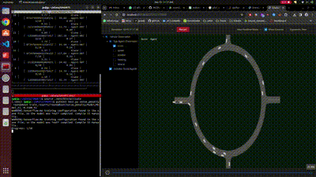
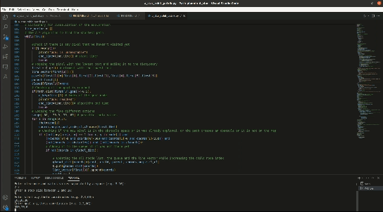
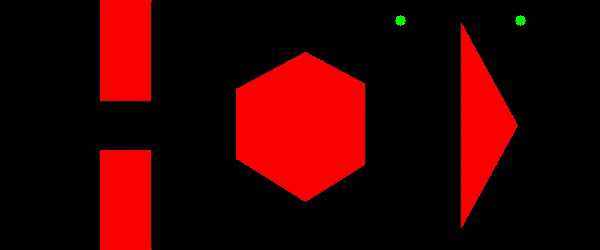
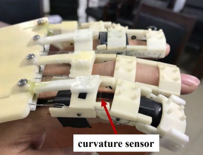
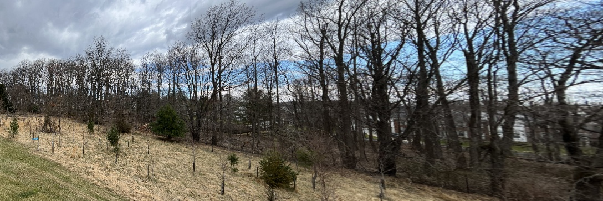

## 🚀 About Me

I'm a passionate **Robotics, Automation, and Control Engineer** with expertise in **Robotics**, **AI**, **Automation Systems**, and **Control Systems**.

- 🎓 **Master of Engineering in Robotics** from the **University of Maryland**
- 🤖 Fascinated by the intersection of technology and practical applications in robotics.
- 🌱 Passionate about **robotics**, **automation**, **industrial systems**, and **AI integration**.
- 🍳 Enthusiast in the kitchen, always experimenting with new recipes and flavors.
- ⚡ Fun fact **I am funny**

## 🛠 Technical Skills

### **Programming & Scripting:**

)

### **OS & IDE**

### **Robotics Skills:**

### **Automation Skills:**

### **Tools & Technologies:**

## 🏗 Projects

- **[Autonomous Mobile Robot](https://github.com/RohitReddy16/Autonomous-Mobile-Robot)**: Developed an AGV using Arduino and sensor integration for Bluetooth control and obstacle avoidance, improving operational efficiency by 35%.
- **[Path Planning Algorithms](https://github.com/RohitReddy16/Project5_Improved-RRT)**: Implemented A\*, Dijkstra, and RRT algorithms for path planning, integrated with a TurtleBot3 for real-time obstacle-free navigation using ROS.
- **[RF/UWB-based Collision Avoidance System](https://github.com/RohitReddy16/Collision-Avoidance)**: Designed a collision avoidance system for AGVs using RF and UWB technologies, optimizing safety in industrial environments.
- **[PLC-based Industrial Manufacturing Automation](https://github.com/RohitReddy16/PLC-Object-Segregation)**: Programmed a software model for object segregation using Ladder Logic and HMI

## :clamp: &nbsp; Projects
[</img>](https://github.com/RohitReddy16/PLC-Object-Segregation)
[</img>](https://github.com/RohitReddy16/Fiducial-Marker-Search-Robot)
[</img>](https://github.com/RohitReddy16/Project5_Improved-RRT-)
[</img>](https://github.com/RohitReddy16/Lane-Changing-using-Deep-Reinforcement-Learning)
[</img>](https://github.com/RohitReddy16/Autonomous-Mobile-Robot)
[</img>](https://github.com/RohitReddy16/Manipulative-Wheeled-Robot-for-Hospitality-Industry)
[</img>](https://github.com/RohitReddy16/A-star-algorithm)
[</img>](https://github.com/RohitReddy16/Object-detection-and-Counting)
[</img>](https://github.com/RohitReddy16/Dijkstra-Algorithm-for-Path-Planning-of-point-robot)
[</img>](https://github.com/RohitReddy16/Design-and-Control-of-a-Wearable-Hand-Rehabilitation-Robot/blob/main/rpakhala_tarunsai_finalreport.pdf)
[</img>](https://github.com/RohitReddy16/Panaroma)
[</img>](https://github.com/RohitReddy16/Health-of-Transformer)

## 📜 Certifications

- **Foundations of Robot Motion** – Northwestern University
- **Computational Motion Planning** – University of Pennsylvania
- **Aerial Robotics** – University of Pennsylvania

  

"Engineering the future of automation and robotics."
