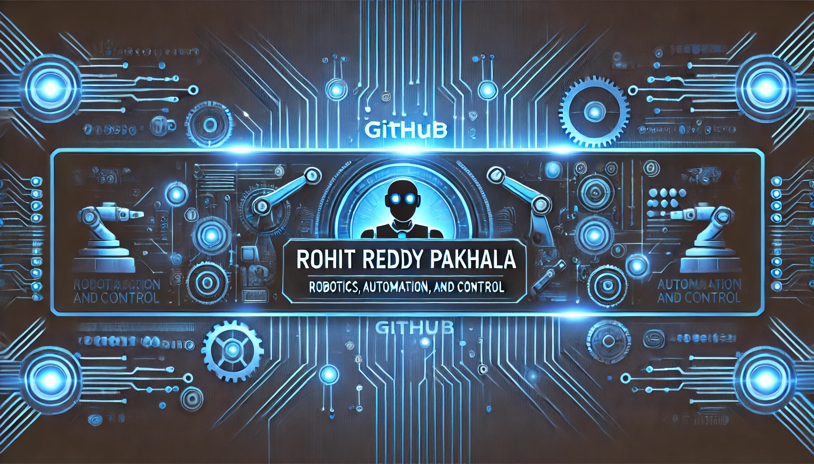

# Hi 👋, I'm Rohit Reddy Pakhala! 

## 🚀 About Me

I'm a passionate **Robotics, Automation, and Control Engineer** with expertise in **Robotics**, **AI**, **Automation Systems**, and **Control Systems**.

- 🎓 **Master of Engineering in Robotics** from the **University of Maryland**
- 🎓 **Bachelor of Engineering in Electronincs and Instruemtnation**
- 💼 Experienced with **ROS**, **Python**, **C++**, and **MATLAB**.
- 🌱 Passionate about **robotics**, **automation**, **industrial systems**, and **AI integration**.
- 🔭 Currently working on projects involving **System Integration** and **AI-based automation**.
- ⚡ Fun fact **I am funny**

## 🛠 Technical Skills
## 🛠 Technical Skills

### **Languages:**
- 
- 
- 
- 
- 
- 
- )
- 
- 

### **Automation Skills:**
- 
- 
- 
- 
- 
- 
- 

### **Tools:**
- 
- 
- 
- 
- 
- 
- 
- 
- 
- 
-

### **Programming & Scripting:**

### **OS**

### **Robotics & Automation:**

### **Tools & Technologies:**

## 🏗 Projects

- **[Autonomous Mobile Robot](https://github.com/RohitReddy16/Autonomous-Mobile-Robot)**: Developed an AGV using Arduino and sensor integration for Bluetooth control and obstacle avoidance, improving operational efficiency by 35%.
- **[Path Planning Algorithms](https://github.com/RohitReddy16/Project5_Improved-RRT)**: Implemented A\*, Dijkstra, and RRT algorithms for path planning, integrated with a TurtleBot3 for real-time obstacle-free navigation using ROS.
- **[RF/UWB-based Collision Avoidance System](https://github.com/RohitReddy16/Collision-Avoidance)**: Designed a collision avoidance system for AGVs using RF and UWB technologies, optimizing safety in industrial environments.
- **[UWB-based Smart Home Automation System](https://github.com/RohitReddy16/Smart-Home-Automation)**: Created a smart home system using UWB sensors for automated security and lighting control.
- **[PLC-based Industrial Manufacturing Automation](https://github.com/RohitReddy16/PLC-Object-Segregation)**: Programmed a software model for object segregation using Ladder Logic and HMI 

## 📜 Certifications

- **Foundations of Robot Motion** – Northwestern University
- **Computational Motion Planning** – University of Pennsylvania
- **Aerial Robotics** – University of Pennsylvania

## 🌱 Current Interests

- **Robotics in Manufacturing**: Exploring the integration of machine vision and AI into industrial robotics.
- **Control Systems**: Developing advanced control algorithms for precise automation in industrial settings.

---

"Engineering the future of automation and robotics."
